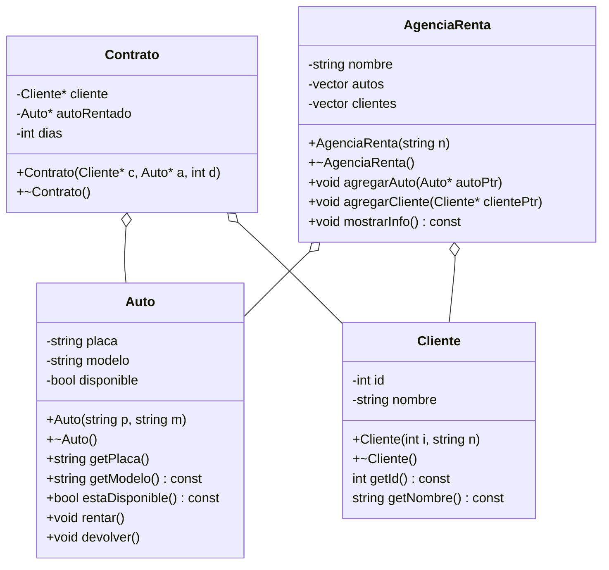

```mermaid
classDiagram

class Auto {
-string placa
-string modelo
-bool disponible
+Auto(string p, string m)
+~Auto()
+string getPlaca()
+string getModelo() const
+bool estaDisponible() const
+void rentar()
+void devolver()
}

class Cliente {
-int id
-string nombre
+Cliente(int i, string n)
+~Cliente()
int getId() const
string getNombre() const
}

class Contrato{
-Cliente* cliente
-Auto* autoRentado
-int dias
+Contrato(Cliente* c, Auto* a, int d)
+~Contrato()
}

class AgenciaRenta{
-string nombre
-vector <Auto*> autos
-vector <Cliente*> clientes
+AgenciaRenta(string n)
+~AgenciaRenta()
+void agregarAuto(Auto* autoPtr)
+void agregarCliente(Cliente* clientePtr)
+void mostrarInfo() const
}

AgenciaRenta o-- Auto
Contrato o-- Auto
Contrato o-- Cliente
AgenciaRenta o-- Cliente
```
